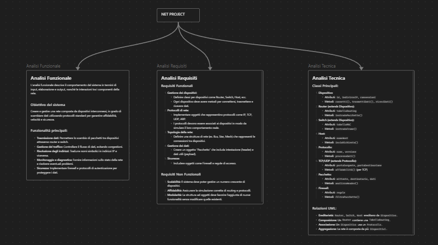

# Net_Project_Sistemi
Realizzazione funzionamento di una rete con oggetti propri

## Analisi Funzionale
L'analisi funzionale descrive il comportamento del sistema in termini di input, elaborazione e output, nonché le interazioni tra i componenti della rete.

#### Obiettivo del sistema

Creare e gestire una rete composta da dispositivi interconnessi, in grado di scambiare dati utilizzando protocolli standard per garantire affidabilità, velocità e sicurezza.

#### Funzionalità principali:

- **Trasmissione dati:** Permettere lo scambio di pacchetti tra dispositivi attraverso router e switch.
- **Gestione del traffico:** Controllare il flusso di dati, evitando congestioni.
- **Risoluzione degli indirizzi:** Tradurre nomi simbolici in indirizzi IP e viceversa.
- **Monitoraggio e diagnostica:** Fornire informazioni sullo stato della rete e risolvere eventuali problemi.
- **Sicurezza:** Implementare firewall e protocolli di autenticazione per proteggere i dati.

## Analisi dei Requisiti
#### Requisiti Funzionali

1. **Gestione dei dispositivi:**
    
    - Definire classi per dispositivi come Router, Switch, Host, ecc.
    - Ogni dispositivo deve avere metodi per connettersi, trasmettere e ricevere dati.
2. **Protocolli di rete:**
    
    - Implementare oggetti che rappresentino protocolli come IP, TCP, UDP, ARP.
    - I protocolli devono essere associati ai dispositivi in modo da simulare il loro comportamento reale.
3. **Topologia della rete:**
    
    - Definire una struttura di rete (es. Bus, Star, Mesh) che rappresenti le connessioni tra dispositivi.
4. **Gestione dei dati:**
    
    - Creare un oggetto "Pacchetto" che includa intestazione (header) e dati utili (payload).
5. **Sicurezza:**
    
    - Includere oggetti come Firewall e regole di accesso.

#### Requisiti Non Funzionali

1. **Scalabilità:** Il sistema deve poter gestire un numero crescente di dispositivi.
2. **Affidabilità:** Assicurare la simulazione corretta di routing e protocolli.
3. **Modularità:** La struttura ad oggetti deve favorire l'aggiunta di nuove funzionalità senza modificare quelle esistenti.

##Analisi Tecnica
#### Classi Principali:

1. **Dispositivo:**
    
    - Attributi: `id`, `indirizzoIP`, `connessioni`
    - Metodi: `connetti()`, `trasmettiDati()`, `riceviDati()`
2. **Router (extends Dispositivo):**
    
    - Attributi: `tabellaRouting`
    - Metodi: `instradaPacchetto()`
3. **Switch (extends Dispositivo):**
    
    - Attributi: `tabellaMAC`
    - Metodi: `instradaFrame()`
4. **Host:**
    
    - Attributi: `nomeHost`
    - Metodi: `inviaRichiesta()`
5. **Protocollo:**
    
    - Attributi: `nome`, `versione`
    - Metodi: `processaDati()`
6. **TCP/UDP (extends Protocollo):**
    
    - Attributi: `portaSorgente`, `portaDestinazione`
    - Metodi: `affidabilità()` (per TCP)
7. **Pacchetto:**
    
    - Attributi: `mittente`, `destinatario`, `dati`
    - Metodi: `analizzaHeader()`
8. **Firewall:**
    
    - Attributi: `regole`
    - Metodi: `filtraPacchetto()`

#### Relazioni UML:

- **Ereditarietà:** `Router`, `Switch`, `Host` ereditano da `Dispositivo`.
- **Composizione:** Un `Router` contiene una `TabellaRouting`.
- **Associazione:** Un `Dispositivo` usa un `Protocollo`.
- **Aggregazione:** La rete è composta da più `Dispositivi`.

